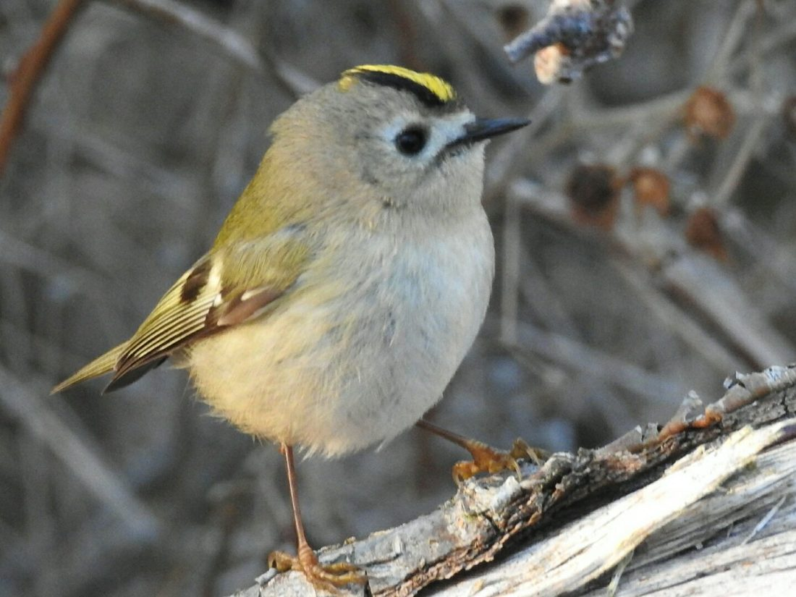

# Woodhead and Windyhills Community Trust — website

Plain HTML and CSS. No build step, no framework, nothing to install. Every page is a
file you can open, read and edit in the GitHub web interface.

---

## 1. Put the files in the repository

Go to the `wwct` repository, click **Add file → Upload files**, and drag in everything
from this folder. Commit to the `main` branch.

## 2. Turn on GitHub Pages

**Settings → Pages**. Under *Build and deployment*, set Source to **Deploy from a
branch**, branch `main`, folder `/ (root)`. Save. After a minute or two the site is live
at `https://<your-username>.github.io/wwct/`.

## 3. Point windyhills.org at it (do this last)

Only once you are happy with how the site looks. The `CNAME` file in this repository
already contains `www.windyhills.org`.

At whoever holds the domain (currently Wix, or a registrar), set:

- a `CNAME` record for `www` pointing to `<your-username>.github.io`
- four `A` records for the bare domain `windyhills.org` pointing to `185.199.108.153`,
  `185.199.109.153`, `185.199.110.153` and `185.199.111.153`

Then in **Settings → Pages**, enter `www.windyhills.org` as the custom domain and tick
**Enforce HTTPS** once the certificate is issued. DNS changes can take a few hours.

Keep the Wix site live until this step is finished.

---

## Where things are

| File | Page |
|---|---|
| `index.html` | Home |
| `about.html` | Our story |
| `our-work.html` | Our work |
| `resources.html` | Resources index |
| `news.html` | News |
| `get-involved.html` | Ways to help |
| `donate.html` | Donate |
| `contact.html` | Contact |
| `birds.html`, `moths.html`, … | The twelve record galleries |
| `styles.css` | All the styling for every page |
| `gallery.js` | Click-to-enlarge on gallery photos |
| `images/` | All photographs |

## Adding photographs

Each gallery has its own folder inside `images/` — birds go in `images/birds/`, moths in
`images/moths/`, and so on. Upload photos there using **Add file → Upload files**.

Then open the matching page (for example `birds.html`), click the pencil icon, and add
one block per photo inside the `<ul class="gallery">` list:

```html
<li>
  <figure>
    
    <figcaption>Goldcrest</figcaption>
  </figure>
</li>
```

Two rules that save trouble later: keep filenames lowercase with hyphens instead of
spaces (`great-spotted-woodpecker.jpg`, not `Great Spotted Woodpecker.JPG`), and resize
photos to around 1200 pixels on the long edge before uploading. GitHub will host large
files, but the pages load slowly if you feed them 5MB camera originals.

## Adding a news item

Open `news.html` and copy one of the existing `<li class="news-item">` blocks. Newest
item goes at the top.

## Changing the colours

Everything is set in one place — the `:root` block at the top of `styles.css`.

## What is not carried over

The Wix contact form. GitHub Pages serves static files and cannot process form
submissions, so the contact page uses a direct email link instead. If the Trust wants a
form back, Formspree or Netlify Forms will do it free at this volume.
